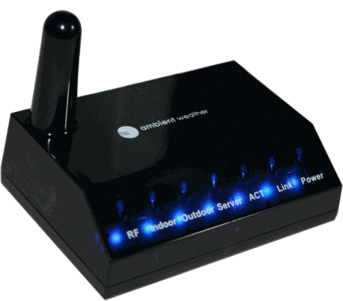

[](https://hub.docker.com/r/glarfs/observerip-proxy-mqtt/)
[](https://github.com/glarfs/docker-observerip-proxy-mqtt/blob/master/LICENSE)
# docker-observerip-proxy-mqtt

Publishes a web server (golang) with a path /weatherstation/updateweatherstation.php that intercepts the request to weather forecast and publishes info on mqtt. The topics used on mqtt are compatible with [WeeWx weather software](https://github.com/weewx/weewx). It is needed to customize the receptor endpoint to point to this docker using wunderground protocol. The credentials should be correct if it is intendet to publish this values to wunderground platform.

The observerip tested variants:
* ethernet based 
* Wifi based: 

Based on projects: 
* [glarfs/docker-observerip-mqtt](https://github.com/glarfs/docker-observerip-mqtt) old scrapping version for observerip, compatible environment variables with this project
* [matthewwall/weewx-observerip](https://github.com/matthewwall/weewx-observerip) php proxy server connected to weewx
* [weewx/mqtt](https://github.com/weewx/weewx/wiki/mqtt) weewx mqtt variables

Tested on the following weather stations:
* WH1200 with ethernet cable on the receptor
* WH2650A with wifi receptor (configured using WS View Android app)


# Build

Using local golang:
```
//dependencies
go get -d -v
// build
go build -i -o bin/proxy
//execute
./bin/proxy
```

Using docker:
```
docker build -t glarfs/observerip-proxy-mqtt .

//docker login to docker-hub
docker login
//username and password
docker push glarfs/observerip-proxy-mqtt
```

Using docker (multiarchitecture)
```
//enable docker experimental features
//docker login to docker-hub
docker login
//username and password
docker buildx build -t glarfs/observerip-proxy-mqtt --platform=linux/arm,linux/arm64,linux/amd64 . --push
```

# Run

Requisites in your local network:
* observerip weather station (y.y.y.y)
* mqtt server (x.x.x.x)
* server with docker (z.z.z.z)

Run the following command remplacing the variables:

```
docker run -p 8080:8080 -e OBSERVER_MQTT_HOST=x.x.x.x -e OBSERVER_MQTT_PORT=1883 -e OBSERVER_MQTT_ENTRYPOINT=my/meteo glarfs/observerip-proxy-mqtt
```

Modify the endpoint on the observerip administration page(http://y.y.y.y) to go to http://[z.z.z.z]:8080/weatherstation/updateweatherstation.php.
Telnet method: telnet y.y.y.y (admin/admin)
```
telnet y.y.y.y
username: admin
password: admin
telnet > setdsthn z.z.z.z
Ok
telnet> saveconfig
Saving Configuration to FLASH
Ok
telnet> reboot

```


# Test

To test application connect the mosquitto client to your mqtt server:
```
mosquitto_sub -v -h x.x.x.x -t my/meteo/#
```
This will show the values pushed to mqtt server

The names used as mqtt topics are compatible with weewx/mqtt
